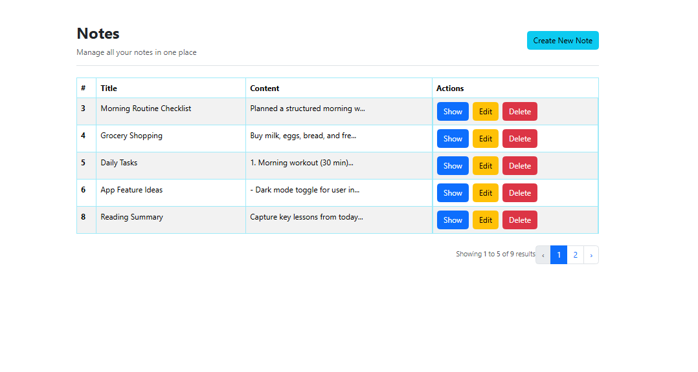
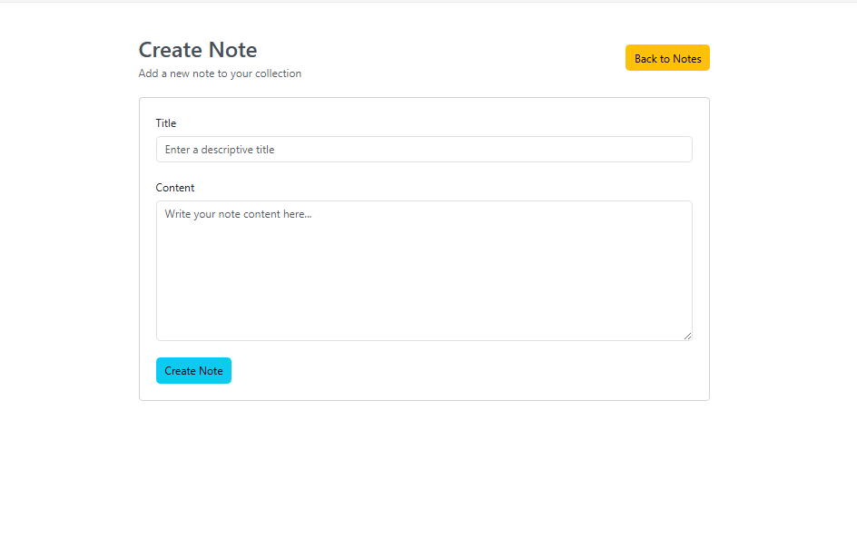
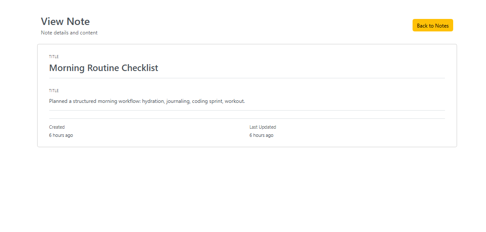

# Notelify


A clean, minimal, and fully functional Notes Management System built with **Laravel 12** and **Bootstrap 5**.  
Notelify allows users to create, view, edit, and delete notes with proper validation, pagination, and a modern UI.

---

## ✨ Features

- Create, read, update, and delete notes (Full CRUD)  
- Form request validation for note details (title + content)  
- Bootstrap-styled pagination for easy navigation  
- Reusable Blade partials for maintainable code  
- Clean, standard, and extendable Laravel structure  
- Fully responsive UI, accessible on any device  

---

## 💻 Tech Stack

| Category | Technology | Version / Requirement |
| :--- | :--- | :--- |
| **Backend Framework** | **Laravel** | 12 |
| **Language** | **PHP** | 8.2+ |
| **Frontend Styling** | **Bootstrap** | 5 |
| **Database** | **MySQL** | Standard |

---

## 🛠️ Installation

### Prerequisites

Ensure you have PHP 8.2+ and Composer installed.

### Steps

1.  **Clone the repository:**

    ```bash
    git clone [https://github.com/Dabeey/notelify.git](https://github.com/Dabeey/notelify.git)
    cd notelify
    ```

2.  **Install PHP and JavaScript dependencies:**

    ```bash
    composer install
    npm install
    npm run build
    ```

3.  **Set up environment variables:**

    ```bash
    cp .env.example .env
    ```

4.  **Update the `.env` file with your database credentials:**

    ```env
    DB_CONNECTION=mysql
    DB_HOST=127.0.0.1
    DB_PORT=3306
    DB_DATABASE=notelify_db # Change this to your desired database name
    DB_USERNAME=root
    DB_PASSWORD=
    ```

5.  **Run database migrations:**

    ```bash
    php artisan migrate
    ```

6.  **Start your development server:**

    ```bash
    php artisan serve
    ```

### Access the Application
http://127.0.0.1:8000/notes


---

## 📂 Project Structure

A clean overview of the key project directories:

app/
  Http/
    Controllers/      # Core application logic
    Requests/         # Form validation rules
  Models/             # Eloquent database models
resources/
  views/
    notes/            # Views specific to notes CRUD
    layouts/          # Base template layouts
    notes/partials/   # Reusable UI components
database/
  migrations/         # Database schema migrations
routes/
  web.php             # Web routes definition

---

## 📸 Screenshots




---

## 🤝 Contributing

Pull requests are welcome. For major changes or new feature proposals, please open an issue first to discuss the idea before starting work.

## 📄 License

This project is open-source and available under the **MIT License**.
